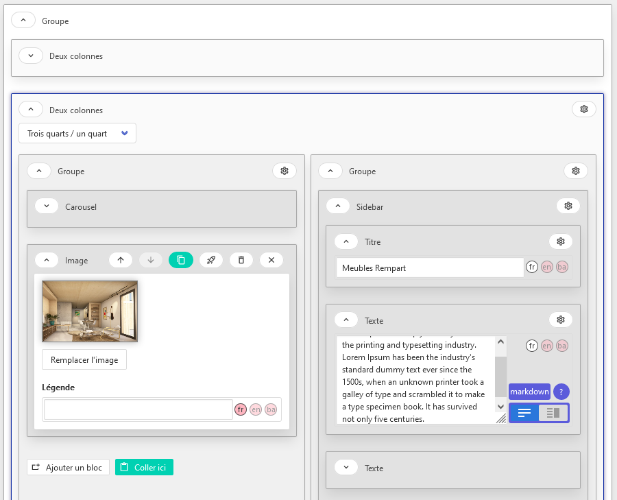

# 🪵 buche

Base d'éditeur d'arbre récursif et arbitraire. Deux composants opaques, `BucheNode` et `BucheBranch` créent un éditeur. Le `BucheNode` racine doit simplement recevoir :

- Un noeud racine
- Une liste de blocs autorisés, dont le bloc générique (voir section "Usage")

## Objectifs

- [x] Mécaniques de base (récursion infinie, ajout, supression, réordonnement, copier/coller, téléportation) sur l'arbre.
- [x] Passage d'une liste de blocs extérieure aux composants.
- [ ] Assez de classes CSS pour styler l'éditeur
- [ ] Skin par défaut basé sur Bulma
- [ ] Gestion de règles avancées
- [x] Blocs étant eux-mêmes des arbres (2 colonnes, 4 colonnes)
- [x] Enfants autorisés / interdis, enfants mini, enfants maxi



## Usage

La seule contrainte : le bloc générique doit s'appeler `generic` et le noeud de départ doit en être une instance. Il doit donc exister dans vos définitions de blocs  personnalisés. Pour cela, vous pouvez l'importer.

`import {generic_block} from '@documents-org/buche/generic_block';`;

App.vue :

```vue
<buche-node
      :blocks="blocks"
      :path="[]"
      v-if="tree"
      :node="tree"
      @update:node="tree = $event"></buche-node>
```

Où `tree` est le noeud de départ, comme cela (instance de `generic_block.constructor()` ):

```js
this.tree = {
    root: true,
    type: 'generic',
    data: {},
    children: [],
    uuid: uuidv4(),
}
```

Et `blocks` une liste des blocs autorisés, comme ceci :

```js
export const blocks = {
    text: {
        type: 'text',
        label: 'Bloc texte',
        constructor: () => ({
            data: {
                content: "",
            },
            root: false,
            type: 'text',
            children: [],
            uuid: uuidv4(),
        }),
        editor: 'TextEditor', 
        has_children: false,
    },
    generic: {
        type: 'generic',
        label: 'Groupe',
        constructor: () => ({
            data: {},
            root: false,
            type: 'generic',
            children: [],
            uuid: uuidv4(),
        }),
        children_min: 0,
        has_children: true,
    },
};
```


## Project setup
```
yarn install
```

### Compiles and hot-reloads for development
```
yarn serve
```

### Compiles and minifies for production
```
yarn build
```

### Lints and fixes files
```
yarn lint
```

### Customize configuration
See [Configuration Reference](https://cli.vuejs.org/config/).
